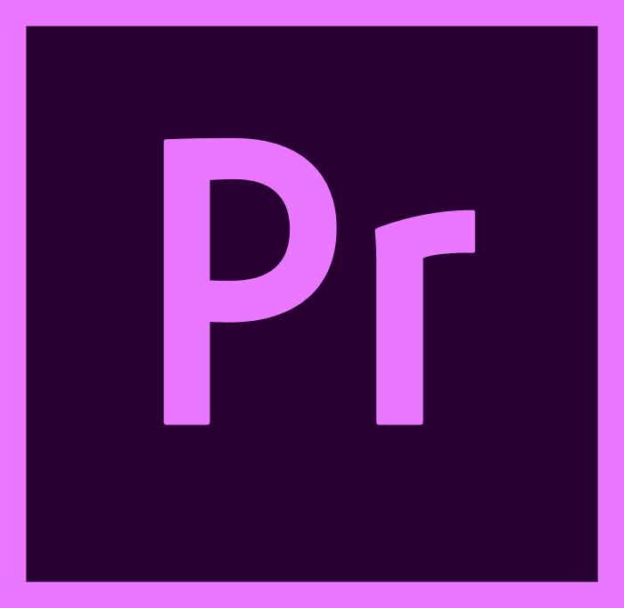

# 🙋‍♀️ About Me

<!-- Header Image -->

### 
Full-stack developer 👨‍💻 crafting dynamic websites and robust back-end solutions. 🚀

### 👋 Hey there!

- 💻 I’m a Full-Stack Developer focused on creating dynamic websites
- 🎯 Mastering Laravel and PHP: Building robust web apps with the latest techniques.
- 👀 I’m interested in Team Work
- 🤝 Always open to collaborating on creative projects
- 💬 Let’s talk about anything from development to design principles
- 📫 Reach me out mariamkareem772@gmail.com
- ⚡ Fun fact: I could spend all day optimizing code for performance and never get bored!😄 
 

# 🚀 My Skill Set  

## Frontend

<!-- Languages and Framworks -->

 
<!-- JavaScript -->

## Backend  

  

## DevOps  

  

<!-- Graphics Designing -->
## Graphics and UI/UX Designing

 

## Socials

> Glad you’re here!
>  
> Let’s celebrate our new connection!

    
  
   

   

# 📊 My Github Stats

<!-- Stats -->

 

<!-- Streak -->

 

<!-- Most Used Language -->

 

<!-- # ⏰ My Coding Time -->

<!-- Wakatime Stats -->
<!-- 

  -->
<!-- Wakatime Chart -->
<!-- 

 -->

 
<!-- Badges -->
<!-- Views Couner -->
<!-- 

 -->

<!-- Wakatime -->
<!-- 

 -->

<!-- Gift -->
<!-- 

    

 -->
##  Support

| Support Me | Sponsor Me |
| :--------: | :--------: |
|| |

